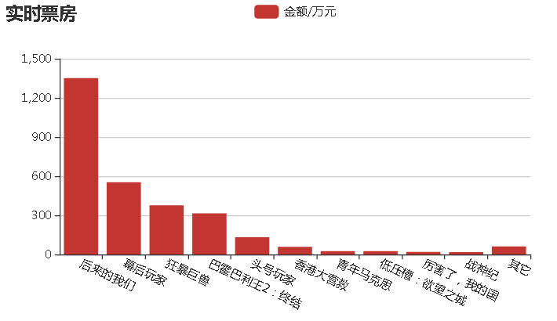

js代码如下所示：
```
// echarts图表绘制函数
function myData(text) {
  var xA = [];
  var yA = [];
  // 将获取到的json数据列表清洗数据后push到xA、yA两个坐标轴数据列表
  // 注意，此处循环函数可以用于未知数量的数据，不必提前预知数据量大小
  for(var i = 0; i < text.data.length; i++) {
    xA.push(text.data[i].MovieName);
		yA.push(text.data[i].BoxOffice);
	}
	var myChart = echarts.init(document.getElementById('res'));
	var option = {
		title: {
			text: '实时票房'
		},
		tooltip: {},
		legend: {
			data: ['金额/万元']
		},
		grid: {
  		y2: 140
		},
		xAxis: {
			data: xA,
  		axisLabel: {
				interval: 0,
				rotate: -25
			}
		},
		yAxis: {},
		series: [{
			name: '金额/万元',
			type: 'bar',
			data: yA,
		}]
	};
myChart.setOption(option);
};

// ajax异步获取json函数
function myJson() {
	$.ajax({
		type: "get",
		url: "http://api.shenjian.io/",
		data: {
			appid: "dd648129b0e17057b8901c27f4a88021"
		},
		dataType: "jsonp",
		success: function(data) {
      // 获取json数据后传递给图表函数
			myData(data)
		}
	});
};
// 执行数据获取函数
myJson();
```
