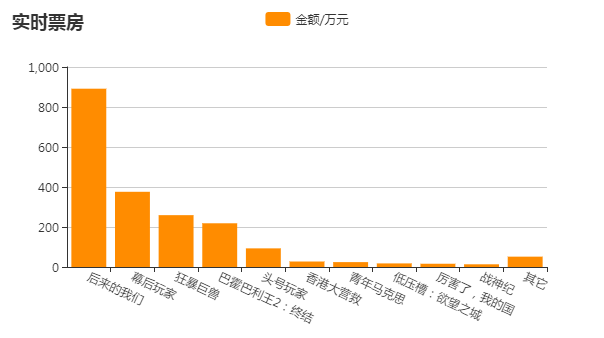

js代码如下

	```	<script>
			function myHq() {
				$.ajax({
					type: "get",
					url: "http://api.shenjian.io/",
					data: {appid: "dd648129b0e17057b8901c27f4a88021"},
					dataType: "jsonp",
					//对该成功获取的数据进行处理
					success: function(data) {
						var xA = [];
						var yA = [];
				//通过两个循环遍历对对获取到的数据进行清洗
				for(var i = 0; i < data.data.length; i++) {
					xA.push(data.data[i].MovieName);
				}
				for(var n = 0; n < data.data.length; n++) {
				
					yA.push(data.data[n].BoxOffice);
				}
				var myChart = echarts.init(document.getElementById('main'));
				var option = {
					color: ['#FFFF00'],
					title: {
						text: '实时票房',
					},
					tooltip: {},
					legend: {
						data: ['金额/万元']
					},
					grid: {
						y2: 150   //调整显示y轴的具体长度
					},
					xAxis: {
						data: xA,
						axisLabel: {
							interval: 0,//横轴信息全部显示
							rotate: -30//-30度角倾斜显示
						}
					},
					yAxis: {},
					series: [{
						name: '金额/万元',
						type: 'bar',
						data: yA,
					}]
				};
				myChart.setOption(option);
					}
					
				});
			};
			myHq();
	```
