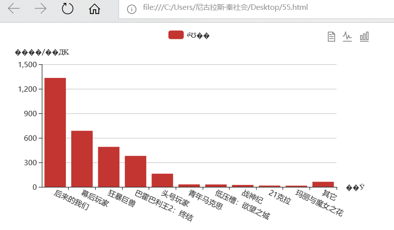

**js代码：**
```
// echarts图表绘制函数
<script>
			function myData(text) {
				var xA = [];
				var yA = [];
        // 将获取到的json数据列表清洗数据后push到xA、yA两个坐标轴数据列表
	     // 注意，此处循环函数可以用于未知数量的数据，不必提前预知数据量大小
				for(var i = 0; i < text.data.length; i++) {
					xA.push(text.data[i].MovieName);
					yA.push(text.data[i].BoxOffice);
				}
				var myChart = echarts.init(document.getElementById('main'));
				var option = {
					title: {
						text: ''
					},
					toolbox: { 
						show:true,
						feature:{
							dataView:{
								show:true
							},
							saveAsImae:{
								show:true
							},
							magicType:{
								type:['line','bar']
							}
						}
					},
					tooltip: {},
					legend: {
						data: ['实时票房']
					},
					grid: {
						y2: 140
					},
					xAxis: {
						name:'电影',
						data: xA,
						axisLabel: {
							interval: 0,
							rotate: -25
							
						}
					},
					yAxis: {
						type:'value',
						name:'金额/万元'
					},
					series: [{
						name: '实时票房',
						type: 'bar',
						data: yA,
					}]
				};
				myChart.setOption(option);
			};
      // ajax异步获取json函数
			function myJson() {
				$.ajax({
					type: "get",
         // 请求服务器地址(url)
					url: "http://api.shenjian.io/",
					data: {
						appid: "dd648129b0e17057b8901c27f4a88021"  //传入到服务器的参数为(data)
					},
					dataType: "jsonp",     //预期服务器返回的数据类型(dataType)
					success: function(data) {
          // 获取json数据后传递给图表函数
						myData(data)
					}
				});
			};
      // 执行数据获取函数
			myJson();
      ```
