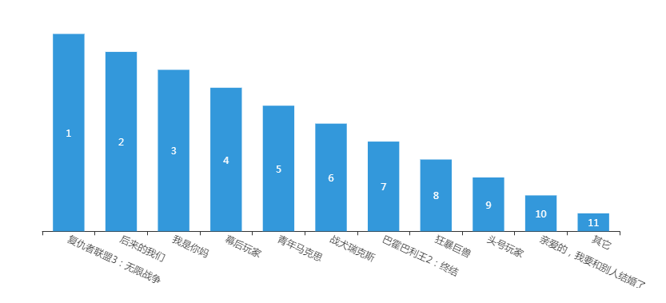

echarts.js代码如下所示：
```
function xyecharts(x,y){
			var myChart = echarts.init(document.getElementById('DXY'));
				var option = {
					title: {
						text: '实时票房'
					},
					color: ['#3398DB'],
// 					tooltip : {
//  				 trigger: 'axis',
//   					axisPointer : {      // 坐标轴指示器，坐标轴触发有效
//    					 type : 'shadow'    // 默认为直线，可选为：'line' | 'shadow'
//  							 		}
//								 },
   					grid: {
    				 left: '3%',
    				 right: '4%',
    				 bottom: '3%',
     					containLabel: true
  						 },
					xAxis: {
						data: x,
						axisLabel: {
							interval: 0,
							rotate: -25
						}
					},
					yAxis: {
						 show: false,
					},
					series: [{
						name: '金额/万元',
						type: 'bar',
						data: y,
						label: {
                                	normal: {
                                		show: true,
											formatter: function(vale) {
											 return y[vale.data-1]
												}
                                			
                                		
                                	}
                                		
                             
                                }
					}]
				};
				
		myChart.setOption(option);		
}
```
ajax.js
```
function Json(url,appid,type,datatype){
	$.ajax({  
           type:type,  
           url: url,
           data: {
		          appid:appid
	              },
           cache : false,   
           dataType: datatype,  
           success: function(data) {
           	var x = [];
				var y = [];
			
				for(var i = 0; i < data.data.length; i++) {
					x.push(data.data[i].MovieName);
					y.push(data.data[i].Irank);
					
					
				}
				y.reverse()
				xyecharts(x,y); 

							}						
				});
		
				
	};
