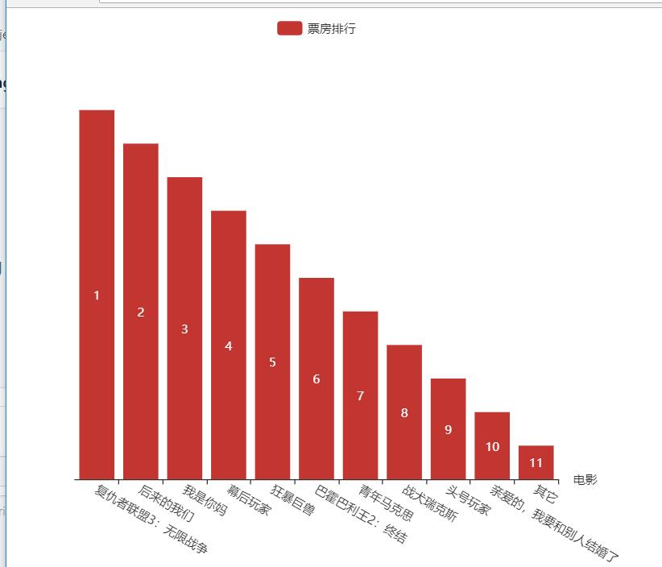

echart.js代码：
```

function varChart(data1, data2) {
	var myChart = echarts.init(document.getElementById('main'));
	var option = {
		legend: {
			data: ['票房排行']
		},
		grid: {
			y2: 140
		},
		xAxis: {
			name:'电影',
			data: data2,
			axisLabel: {
				interval: 0,
				rotate: -30
			}
		},
		yAxis: {
			show: false
		},
		series: [{
			data: data1.sort(function(x, y) {
				return y - x
			}),
			type: 'bar',
			name: '票房排行',
			label: {
				normal: {
					show: true,
					formatter: function(a) {
						return data1[a.value - 1]
					}
				}
			}
		}]
	};
	myChart.setOption(option);
}             
```
ajax,js代码：
```
function Json(Url, Id, Type, DataType) {
	$.ajax({
		type: Type,
		url: Url,
		data: {
			appid: Id
		},
		dataType: DataType,
		success: function(data) {
			intex(data);
		}
	});
}

function intex(data) {
	var data1 = [];
	var data2 = [];
	for(var i = 0; i < data.data.length; i++) {

		data1.splice(i, 0, data.data[i].Irank);
		data2.splice(i, 0, data.data[i].MovieName);
		
	};
	varChart(data1, data2);
}
```
