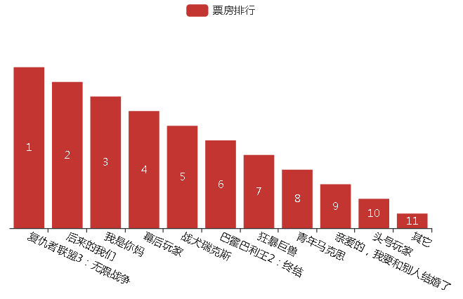

ajax的js代码如下所示：
```
$.ajax({
	type: "get",
	url: "http://api.shenjian.io/",
	data: {
		appid: "dd648129b0e17057b8901c27f4a88021"
	},
	dataType: "jsonp",
	success: function(data) {
		topClean(data);
	}
});

function topClean(data) {
	var topData1 = [];
	var topData2 = [];
	for(var i = 0; i < data.data.length; i++) {
		topData1.splice(i, 0, data.data[i].Irank);
		topData2.splice(i, 0, data.data[i].MovieName);
	};
	topChart(topData1, topData2);
}
```
echarts的js代码如下所示：
```
function topChart(Data1, Data2) {
	var myChart = echarts.init(document.getElementById('top'));
	var option = {
		legend: {
			data: ['票房排行']
		},
		grid: {
			y2: 140
		},
		xAxis: {
			data: Data2,
			axisLabel: {
				interval: 0,
				rotate: -25
			}
		},
		yAxis: {
			show: false
		},
		series: [{
			data: Data1.sort(function(a, b) {
				return b - a
			}),
			type: 'bar',
			name: '票房排行',
			label: {
				normal: {
					show: true,
					formatter: function(value) {
						return Data1[value.value - 1]
					}
				}
			}
		}]
	};
	myChart.setOption(option);
}
```
