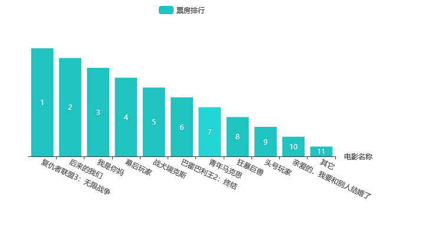

ajax.js 如下
```
function myHq(HqUrl, HqId, HqType, HqDataType) {
	$.ajax({
		type: HqType,
		url: HqUrl,
		data: {
			appid: HqId
		},
		dataType: HqDataType,
	//	beforeSend: function(aaa) {
	//		console.log(aaa);
	//		alert('请求开始啦!!');
			//在请求操作之前
	//	},
		//对该成功获取的数据进行处理
		success: function(data) {
			var hqData1 = [];
			var hqData2 = [];
			for(var i = 0; i < data.data.length; i++) {
				hqData1.splice(i, 0, data.data[i].Irank);
			
			};
			for(var n = 0; n < data.data.length; n++) {
				
				hqData2.splice(n, 0, data.data[n].MovieName);
			};
			hqChart(hqData1, hqData2);
		}
	});
}
```
echarts.js如下
```
function hqChart(Data1, Data2) {
	var myChart = echarts.init(document.getElementById('main'));
	var option = {
		color: ['#20C3C0'],
		legend: {
			data: ['票房排行']
		},
		grid: {
			y2: 140
		},
		xAxis: {
			name:'电影名称',
			data: Data2,
			axisLabel: {
				interval: 0,
				rotate: -25
			}
		},
		yAxis: {
			show: false
		},
		series: [{
			name: '票房排行',
			data: Data1.reverse(),//将数组反转
			//arr.reverse(Data1),
//			Data1.sort(function(x, y) {
//				return y - x   //比较函数两个参数x和y，返回x-y升序，返回y-x降序
//				//return x - y
//			}),
			
			type: 'bar',
			label: {
				normal: {
					show: true,
					formatter: function(value) {
						return Data1[value.data-1]
						//数组角标-1
					}
				}
			}
		}]
	};
	myChart.setOption(option);

}
```
