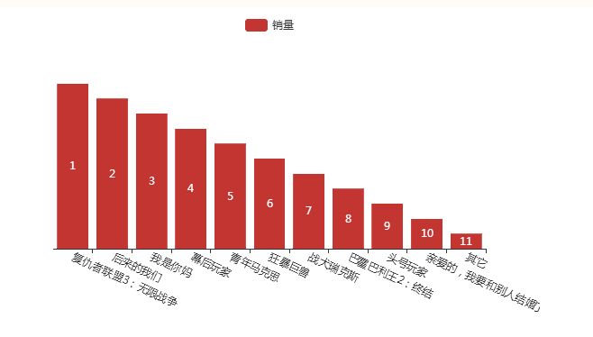

```
ajax代码块
function Json(jsonUrl, jsonId, JsonType, JsonDataType) {
	$.ajax({
		type: JsonType,
		url: jsonUrl,
		data: {
			appid: jsonId
		},
		dataType: JsonDataType,
		success: function(text) {
			ech1(text);
		}
	});
}
				
	function ech1(text){
			            var A = [];
				        var B = [];
						for(var x = 0; x < text.data.length; x++) {
					A.push(text.data[x].MovieName);//将MoveNaneme存入xA
				B.push(text.data[x].Irank);
		//alert(text.data[1].Irank);
	};
						chart( A , B);
					}

```
  
```
echarts代码块
	function chart(A,B){
	var chart = echarts.init(document.getElementById('ech')); 
        var option = {
                            tooltip: {  
                                show: false,  
                            },  
                            legend: {  
                                data:['销量']  
                            },  
              grid: {
			y2: 140
		},
					xAxis: {
						
						data: A,
						axisLabel: {
							interval: 0,
							rotate: -25
							
						}
					},
                           yAxis: {
                           	show:false,
                           },
                       	series: [{
					data:B.sort(function(a, b) 
					
					{
				return b - a
			}),
						name: '销量',
						type: 'bar',
						label: {
				normal: {
					show: true,
					formatter: function(num) {
						return B[num.data - 1]
					}
				}
				}
						
					}]
                       
                       };
     	chart.setOption(option);
        }

```
