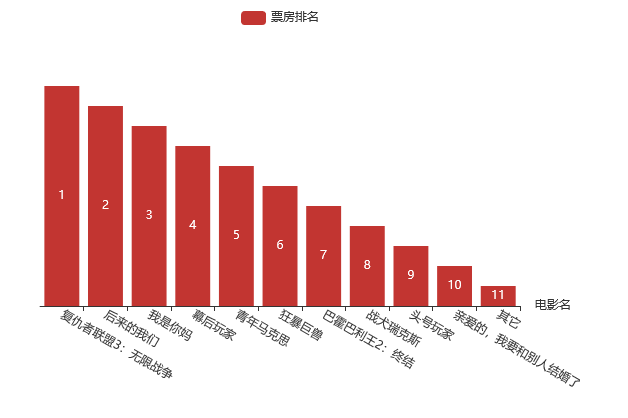

echerswork.js代码如下：
```
function MovieInit(MovieName, Irank) {
	var myChart = echarts.init(document.getElementById('work'));
	var option = {
	             legend: {
	                 data:['票房排名']
	             },
	             grid: {
	             		y2:100
	             },
	             xAxis: {
	             	 name:'电影名',
	                 data: MovieName,
	                 axisLabel: {
	                 		interval: 0,
	                 		rotate: -30
	                 }
	             },
	             yAxis: {
	             		show:false
	             },
	             series: [{
	                 name: '票房排名',
	                 type: 'bar',
	                 data: Irank,
	                 
	                 label: {
						normal: {
							show: true,
							formatter: function(value) {
								return Irank[value.value-1]
							}
						}
					}
	                 
	             }]
	         };
	         myChart.setOption(option);
}
```
ajaxwork.js代码如下：
```
function MovieData() {
	$.ajax({
	        type : "get",
	        async : true, 
	        url : "http://api.shenjian.io/",    
	        data : {
	    	   	appid: "dd648129b0e17057b8901c27f4a88021"
	        },
	        dataType : "jsonp",
	        success : function(IrankData) {
	        	MovieIrankdata(IrankData);
	        }
	 });
}
function MovieIrankdata(IrankData) {
    var MovieName=[];    
    var Irank=[]; 
    for(var Iran = 0;Iran < IrankData.data.length;Iran++){       
    	MovieName.push(IrankData.data[Iran].MovieName);
        Irank.push(12 - IrankData.data[Iran].Irank);                    
    }
    MovieInit(MovieName, Irank);
}
```
